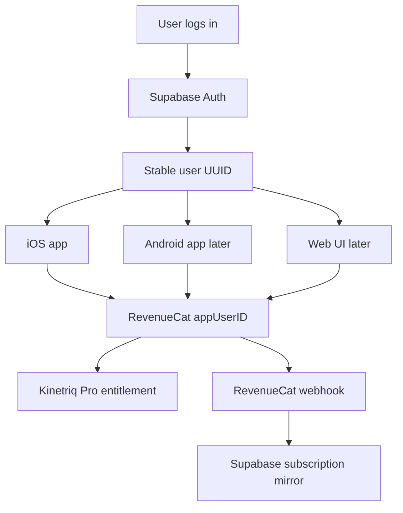

# Kinetriq Subscription + Cross-Device Login Gameplan

## Recommended Architecture

Use **Supabase Auth + Postgres** for identity/account data, and **RevenueCat** for subscription entitlements. RevenueCat is excellent for purchase state, but it should not be the source of user login. The stable user ID should come from your auth backend, then be passed into RevenueCat on every platform.

Recommended default:

- **Marketing site:** keep Squarespace at the public website for landing pages, blog, pricing, and App Store links.
- **Web app:** create a separate hosted app at `app.kinetriq.com` or `dashboard.kinetriq.com` using Next.js/React.
- **Auth/backend:** Supabase Auth with email/password, Sign in with Apple, and later Google sign-in.
- **Entitlements:** RevenueCat entitlement such as `pro` or `kinetriq_pro`, displayed publicly as `Kinetriq Pro`.
- **iOS billing:** App Store subscriptions via RevenueCat.
- **Android billing:** Google Play subscriptions via the same RevenueCat project later.
- **Web billing:** RevenueCat Web Billing or Stripe connected through RevenueCat.
- **Cross-device unlock:** after login, call RevenueCat with the same app user ID on iOS, Android, and web.

Core identity flow:



## Current Repo Starting Point

The checked-out branch is currently `fix/saved-video-loading`. A local and remote `feature/revenuecat-subscriptions` branch already exists and contains the first RevenueCat pass:

- [`Sources/Services/PurchaseService.swift`](/Users/kevinjones/Documents/Kinetriq_app/Sources/Services/PurchaseService.swift) exists on the subscription branch, not the current checked-out branch.
- [`Sources/Views/PaywallView.swift`](/Users/kevinjones/Documents/Kinetriq_app/Sources/Views/PaywallView.swift) exists on the subscription branch.
- [`Sources/Views/PromoCodeView.swift`](/Users/kevinjones/Documents/Kinetriq_app/Sources/Views/PromoCodeView.swift) exists on the subscription branch.
- [`docs/Subscriptions.md`](/Users/kevinjones/Documents/Kinetriq_app/docs/Subscriptions.md) exists on the subscription branch.
- [`project.yml`](/Users/kevinjones/Documents/Kinetriq_app/project.yml) on the subscription branch adds `RevenueCat` and `RevenueCatUI` packages.

Important branch issue: `feature/revenuecat-subscriptions` diverged before the newer saved-video and v3.4.3 changes. Continue by rebasing or merging the subscription branch on top of `fix/saved-video-loading`, then resolve conflicts deliberately. Do not lose the saved-video import fixes or current analyzer/overlay work.

## Product + Pricing Setup

Use one paid tier for launch:

- Tier display name: **Kinetriq Pro**.
- Monthly: **7-day free trial**, then **$4.99/month**.
- Annual: **7-day free trial**, then discounted yearly price. Prior docs used **$34.99/year**, which is about 42% off vs 12 monthly payments.
- Entitlement identifier: prefer a stable code-style ID such as `pro` or `kinetriq_pro`; use `Kinetriq Pro` only as the display name. If keeping the existing branch’s `Kinetriq Pro` entitlement identifier, stay consistent everywhere.
- Product IDs: prefer reverse-DNS IDs before launch, for example `com.kevinjones.kinetriq.pro.monthly` and `com.kevinjones.kinetriq.pro.yearly`, unless App Store Connect and RevenueCat are already finalized with `monthly` and `yearly`.

## Promo And Discount Codes

Support three code types, but do not implement all three as hardcoded local app codes. Codes that affect paid subscriptions should live in the store/RevenueCat billing path when possible, and permanent comp access should live in the backend account system.

- **Free month code:** use App Store promotional offer / offer code for iOS subscriptions, mirrored through RevenueCat. This keeps billing compliant and lets Apple/RevenueCat manage redemption, expiration, and subscription conversion.
- **Discount code:** use App Store promotional offer / offer code for iOS, with matching Google Play and web billing equivalents later. Define the discount clearly before setup, for example 50% off first month, first 3 months, or first year.
- **Unlimited free access code:** use a backend-managed comp entitlement tied to the logged-in user account, not just device-local `UserDefaults`. Store the redeemed code and entitlement in Supabase so it works across iOS, Android, and web.

Recommended data model:

- `promo_codes`: code, type, active flag, max redemptions, redemption count, starts_at, expires_at, notes.
- `promo_redemptions`: user_id, code_id, redeemed_at, platform, device/app version metadata.
- `account_entitlements`: user_id, entitlement, source (`revenuecat`, `promo_free_month`, `promo_discount`, `manual_comp`), starts_at, expires_at, active.

Recommended code examples:

- `KINETRIQ-MONTH`: free month or first-month offer.
- `KINETRIQ-DISCOUNT`: discounted subscription offer.
- `KINETRIQ-COMP`: unlimited free access for trainers, partners, press, or internal testers.

Security rule: never rely on a public app-binary list for valuable public codes. The existing subscription branch’s hardcoded private promo code approach is acceptable only for low-risk beta/tester access. For launch, validate codes through Supabase or store-native redemption and rate-limit attempts.

## Implementation Phases

### Phase 1: Branch Cleanup And RevenueCat Baseline

Goal: bring the existing subscription branch up to date without changing auth yet.

Steps:

- Rebase or merge `feature/revenuecat-subscriptions` onto `fix/saved-video-loading`.
- Keep the latest `project.yml` marketing/build values and MediaPipe plist patch scripts.
- Keep the latest app navigation and exercise-analysis fixes from `fix/saved-video-loading`.
- Add RevenueCat SDK dependencies through `project.yml`, then run `xcodegen generate`.
- Replace development/test RevenueCat API key handling with an environment/build-config-safe approach before launch.
- Decide whether the app should be hard paywalled on launch or use a softer gate such as free limited analyses.

Primary files:

- [`project.yml`](/Users/kevinjones/Documents/Kinetriq_app/project.yml)
- [`Sources/App/KevLines2App.swift`](/Users/kevinjones/Documents/Kinetriq_app/Sources/App/KevLines2App.swift)
- [`Sources/App/ContentView.swift`](/Users/kevinjones/Documents/Kinetriq_app/Sources/App/ContentView.swift)
- [`Sources/Views/SettingsView.swift`](/Users/kevinjones/Documents/Kinetriq_app/Sources/Views/SettingsView.swift)
- `Sources/Services/PurchaseService.swift` from the subscription branch
- `Sources/Views/PaywallView.swift` from the subscription branch

### Phase 2: Add Real User Accounts

Goal: users can create an account and use that login across iOS, Android, and web.

Steps:

- Create Supabase project for Kinetriq.
- Enable Supabase Auth providers:
  - Email/password or magic link for baseline.
  - Sign in with Apple for iOS launch.
  - Google sign-in later for Android/web convenience.
- Add iOS auth SDK or a small auth layer using Supabase’s Swift package.
- Create an `AuthService` or `SessionService` as the single source of truth for login state.
- Add login, signup, logout, reset password, and account deletion UI.
- Store only necessary profile data: user ID, email, display name, created date, subscription mirror fields.
- After successful login, call RevenueCat login with the Supabase user UUID as the RevenueCat app user ID.
- On logout, call RevenueCat logout and clear local session state.

Primary files to add or change:

- `Sources/Services/AuthService.swift`
- `Sources/Models/UserProfile.swift`
- `Sources/Views/Auth/LoginView.swift`
- `Sources/Views/Auth/AccountView.swift`
- [`Sources/Views/SettingsView.swift`](/Users/kevinjones/Documents/Kinetriq_app/Sources/Views/SettingsView.swift)
- [`Sources/App/ContentView.swift`](/Users/kevinjones/Documents/Kinetriq_app/Sources/App/ContentView.swift)

### Phase 3: Link Auth To RevenueCat

Goal: subscription state follows the account, not just one anonymous device install.

Steps:

- Configure RevenueCat after app launch.
- If no user is logged in, allow anonymous RevenueCat mode only for pre-login browsing if desired.
- After login, call `Purchases.shared.logIn(userId)` using the Supabase UUID.
- Refresh customer info immediately after login.
- Gate Pro features based on active RevenueCat entitlement.
- Add restore purchases and Customer Center access in Settings.
- Handle account switching carefully: logout should clear app state and RevenueCat identity.
- Add tests around entitlement parsing and feature-gating decisions.

Design rule: the app should not trust a local boolean forever. Cache for UX, but refresh from RevenueCat and/or the backend when the app starts, returns foreground, or the user opens Account/Settings.

### Phase 4: Promo Code Entitlements

Goal: users can redeem codes for a free month, a discount, or unlimited free access, and those benefits follow the account across devices.

Steps:

- Decide exact code behavior:
  - Free month: one extra month, first month free, or 1-month temporary Pro entitlement.
  - Discount: define discount amount and duration before creating store offers.
  - Unlimited free access: permanent comp entitlement until manually revoked.
- Use App Store offer codes or promotional offers for free-month and discount subscription codes where possible.
- Add Supabase-backed code redemption for unlimited free access and any non-store comp campaigns.
- Add code redemption UI to Account/Settings and paywall access options.
- When a code is redeemed, associate it with the logged-in Supabase user UUID.
- Mirror resulting access into `account_entitlements` so iOS, Android, and web can all see it.
- Keep RevenueCat subscription state and backend comp entitlement checks separate, then combine them into one app-level access decision such as `hasProAccess`.
- Add abuse controls: active/inactive flag, redemption limits, expiration dates, one-use-per-user rules, and server-side validation.

Access decision:

```text
hasProAccess = active RevenueCat entitlement OR active backend comp/promo entitlement
```

### Phase 5: Backend Subscription Mirror

Goal: the web UI can know whether a user is Pro without depending only on a mobile device.

Steps:

- Add Supabase database tables:
  - `profiles`
  - `subscriptions`
  - `revenuecat_events`
  - `promo_codes`
  - `promo_redemptions`
  - `account_entitlements`
- Configure RevenueCat webhooks to a Supabase Edge Function.
- Verify webhook signatures/secrets.
- Upsert subscription state by RevenueCat app user ID.
- Store entitlement identifier, active status, platform, product ID, period end, trial status, and last event timestamp.
- Include promo/comp entitlement status in account queries alongside RevenueCat subscription status.
- Make the web UI read subscription status from Supabase.
- Keep RevenueCat as the source of truth; Supabase is a query/cache layer for app/web UX.

### Phase 6: Squarespace + Web UI

Goal: preserve Squarespace while adding a real product web app.

Steps:

- Keep Squarespace as `kinetriq.com` marketing and SEO site.
- Add buttons/links to `app.kinetriq.com` for login/dashboard.
- Host the web app on Vercel, Netlify, or Supabase hosting.
- Use Supabase Auth on the web app with the same auth project as mobile.
- Add basic web pages:
  - Login/signup
  - Account settings
  - Subscription status
  - Manage billing link
  - Download iOS app link
  - Later: workout/session history, uploads, exports, trainer dashboard
- Decide later whether web users can purchase directly via RevenueCat Web Billing or Stripe through RevenueCat.

### Phase 7: Android Later

Goal: Android uses the same login and entitlement system.

Steps:

- Use the same Supabase Auth project.
- Add the Android app to the same RevenueCat project.
- Configure Google Play subscriptions mapped to the same entitlement.
- Use the Supabase UUID as RevenueCat app user ID.
- Match iOS feature gates and account behavior.

## App Store / Compliance Checklist

Before App Store submission with subscriptions:

- Privacy policy URL live on Squarespace or another stable page.
- Terms of use URL live.
- App Store Connect subscription group created.
- Monthly and annual products created with 7-day free trials.
- Free-month and discount offer-code strategy configured through App Store Connect/RevenueCat where applicable.
- Unlimited free access code is validated server-side and tied to logged-in accounts.
- Subscription localization, review screenshot, and review notes complete.
- RevenueCat iOS app configured with App Store credentials.
- RevenueCat offering marked current.
- Sandbox purchase tests pass on a real device.
- Account deletion is available if user accounts are required.
- “Restore Purchases” visible and working.
- Subscription management path available through Apple/RevenueCat Customer Center.
- App copy clearly states that analysis is not medical advice.

## Cursor Prompt Pack

Use these prompts in order. Start each in **Plan mode** when the scope is unclear, then switch to **Agent mode** only after accepting the plan.

### Prompt 1: Branch Reconcile Plan

Desired Cursor setup: **Plan mode**, model **GPT-5.5**, use an **explore subagent** if available.

```text
We need to continue the Kinetriq subscription branch. Current base branch is fix/saved-video-loading and there is an existing feature/revenuecat-subscriptions branch. Please inspect both branches read-only and create a concise merge/rebase plan. Preserve all saved-video loading fixes, v3.4.3 analyzer/overlay changes, and project.yml version/build settings. Identify exact files likely to conflict and the desired final state. Do not edit files yet.
```

### Prompt 2: Rebase/Merge Subscription Branch

Desired Cursor setup: **Agent mode**, model **GPT-5.5**.

```text
Implement the accepted branch reconciliation plan. Bring feature/revenuecat-subscriptions up to date with fix/saved-video-loading. Resolve conflicts by preserving the latest saved-video loading and v3.4.3 app changes while keeping RevenueCat integration files. After project.yml changes, run xcodegen generate. Do not commit unless I explicitly ask. Run targeted build/tests if available and report any issues.
```

### Prompt 3: RevenueCat Product ID Cleanup

Desired Cursor setup: **Plan mode first**, then **Agent mode**.

```text
Review the RevenueCat integration for production readiness. I want Kinetriq Pro with a 7-day free trial, $4.99/month, and a discounted yearly plan. Recommend final entitlement ID and product IDs before editing. Prefer stable reverse-DNS product IDs unless there is a good reason to keep monthly/yearly. Check PurchaseService, PaywallView, SettingsView, docs/Subscriptions.md, and project.yml. Produce a short plan first.
```

### Prompt 4: Add Supabase Auth Architecture

Desired Cursor setup: **Plan mode**, model **GPT-5.5**.

```text
Plan a Supabase Auth integration for Kinetriq iOS. Requirements: user login across iOS, future Android, and future web UI; Sign in with Apple for iOS; email login or magic link; account deletion; logout; RevenueCat appUserID must use the Supabase user UUID. Inspect the SwiftUI app structure and propose the smallest clean service/view architecture. Do not edit files yet.
```

### Prompt 5: Implement Auth Foundation

Desired Cursor setup: **Agent mode**, model **GPT-5.5**.

```text
Implement the accepted Supabase Auth foundation for Kinetriq iOS. Add an AuthService/SessionService, login/signup/account UI, Settings account section, logout, and account deletion stub or implementation depending on Supabase support. Keep edits scoped. Do not disturb exercise analysis, video processing, or MediaPipe code. Add focused tests where practical.
```

### Prompt 6: Link Auth To RevenueCat

Desired Cursor setup: **Agent mode**, model **GPT-5.5**.

```text
Link Kinetriq auth sessions to RevenueCat. On login, call RevenueCat logIn with the Supabase user UUID. On logout, clear app session and RevenueCat identity. Refresh customer info after login and app foreground. Gate Pro access from the RevenueCat entitlement, not local-only state. Update docs/Subscriptions.md and add tests for entitlement parsing or gating logic where possible.
```

### Prompt 7: Promo Code Plan

Desired Cursor setup: **Plan mode**, model **GPT-5.5**.

```text
Plan promo and discount code support for Kinetriq. Requirements: one code path for a free month, one for a discount, and one for unlimited free access. The app will use Supabase Auth and RevenueCat. Recommend which code types should use App Store/RevenueCat offers versus Supabase-backed redemption. Include database tables, redemption rules, app UI placement, abuse controls, and how the final hasProAccess decision should combine RevenueCat entitlements with backend comp entitlements. Do not edit files yet.
```

### Prompt 8: Implement Promo Code Foundation

Desired Cursor setup: **Agent mode**, model **GPT-5.5**.

```text
Implement the accepted promo code foundation for Kinetriq. Add Supabase-backed redemption support for unlimited free access and app-side access checks that combine RevenueCat entitlement state with backend promo/comp entitlements. Add redemption UI in Account/Settings or paywall access options. Keep free-month and discount codes documented as App Store/RevenueCat offer-code setup unless the plan explicitly chose backend temporary entitlements. Add focused tests for access-decision logic.
```

### Prompt 9: Backend Webhook Plan

Desired Cursor setup: **Plan mode**, model **GPT-5.5**.

```text
Create a backend plan for mirroring RevenueCat subscription state into Supabase. Include proposed tables, row-level security rules, a Supabase Edge Function for RevenueCat webhooks, signature/secret verification, and how the future web UI should query subscription status. Do not edit files yet.
```

### Prompt 10: Web UI Product Plan

Desired Cursor setup: **Plan mode**, model **GPT-5.5**.

```text
Create a plan for the first Kinetriq web UI while keeping Squarespace as the marketing site. Assume the web app will live at app.kinetriq.com, use Supabase Auth, and read subscription status from Supabase/RevenueCat. Define MVP pages, hosting recommendation, environment variables, and integration points with the iOS app. Do not implement yet.
```

### Prompt 11: App Store Subscription QA

Desired Cursor setup: **Agent mode** for code checks, **shell subagent** only for build/test commands if needed.

```text
Audit the Kinetriq subscription implementation for App Store readiness. Check restore purchases, manage subscription/Customer Center, privacy/terms links, subscription copy, free trial copy, sandbox testing instructions, RevenueCat API key handling, product IDs, entitlement IDs, account deletion, free-month offer codes, discount codes, and unlimited free access code validation. Produce findings first, then fixes I should make before submission.
```

## Recommended Agent Choices

- Use **GPT-5.5 in Plan mode** for architecture, auth/backend decisions, and branch reconciliation planning.
- Use **GPT-5.5 in Agent mode** for Swift implementation once the plan is accepted.
- Use an **explore subagent** for broad read-only repo audits.
- Use a **shell subagent** only for command-heavy work such as build/test loops or git investigation.
- Use **ci-investigator** only when a specific CI check fails on a PR.

## Decisions To Make Before Coding

- Final auth provider: recommended **Supabase**.
- Final web app location: recommended `app.kinetriq.com`, with Squarespace remaining the marketing site.
- Final yearly price: recommended **$34.99/year** unless you want a different annual discount.
- Final entitlement/product IDs before App Store products are created.
- Final promo behavior: exact free-month duration mechanics, discount amount/duration, and who can redeem unlimited free access.
- Hard paywall vs limited free tier for launch.
- Whether web purchasing is part of App Store v1 or deferred until after iOS launch.

Recommended immediate next action: reconcile `feature/revenuecat-subscriptions` with `fix/saved-video-loading`, then add auth as a separate follow-up branch/PR so RevenueCat billing and cross-device identity are not tangled in one risky change.
